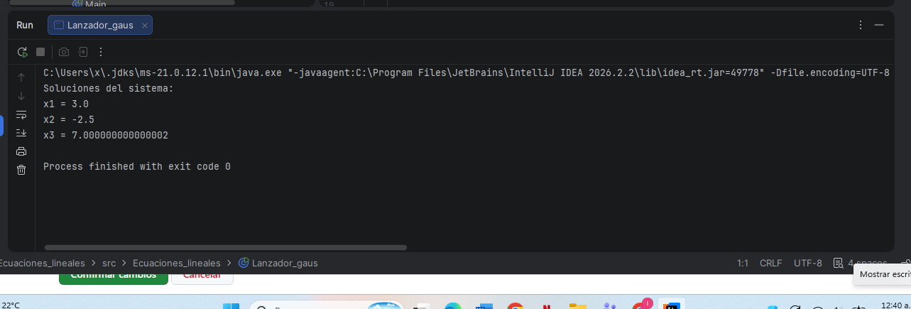

# Método de Gauss

## Descripción
Programa en Java que resuelve sistemas de ecuaciones lineales mediante el método de eliminación de Gauss.

## Materia
Métodos Numéricos

## Requisitos
- JDK 17 o superior
- IntelliJ IDEA

## Archivos
- `src/Ecuaciones_lineales/`: Código fuente del programa.
- `ejecucion.png`: Captura de pantalla de la prueba ejecutada.

## Cómo ejecutar
1. Abrir el proyecto en IntelliJ IDEA.
2. Ejecutar la clase principal `Lanzador_gaus` (o `Main`).

## Prueba realizada
- **Entrada:** Matriz de prueba ingresada en el programa.
- **Salida:** Solución del sistema de ecuaciones obtenida en la consola.

## Evidencia

## Referencias
Material y apuntes de la materia Métodos Numéricos.
